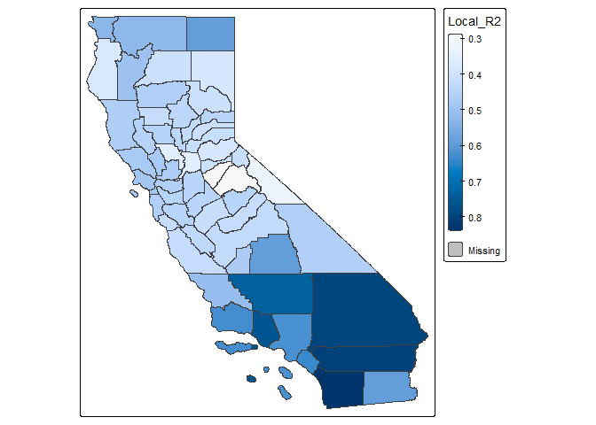
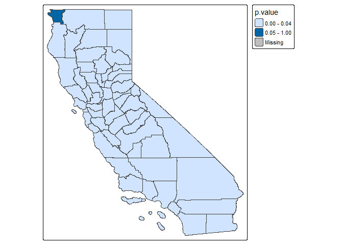
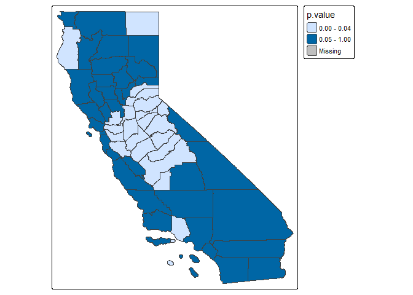
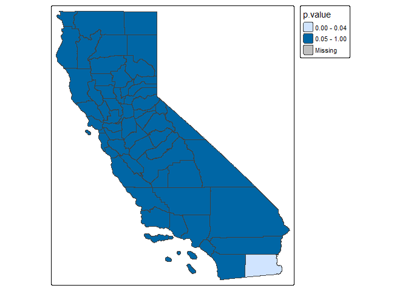

<!-- README.md 由 README.Rmd 生成，请编辑 README.Rmd -->

# GWPR.light

<!-- badges: start -->

[](https://www.repostatus.org/#active)
[](https://github.com/MichaelChaoLi-cpu/GWPR.light/actions)
[](https://ci.appveyor.com/project/MichaelChaoLi-cpu/GWPR.light)
[](https://CRAN.R-project.org/package=GWPR.light)
[](https://lifecycle.r-lib.org/articles/stages.html#stable)
<!-- badges: end -->

本包基于空间统计中的地理加权思想，实现地理加权面板回归（Geographically
Weighted Panel Regression,
GWPR），用于刻画面板回归残差的空间聚集特征。为检验残差是否存在空间聚集，本包提供改进的
Moran’s I 检验，并包含三类局部统计检验以辅助模型选择。  
本包包含：最优带宽选择、GWPR 拟合、局部 Hausman 检验、局部个体效应 F
检验、局部 Breusch-Pagan 拉格朗日乘子检验，以及面板 Moran’s I
检验等函数；同时对计算过程做了内存与性能优化。

## 作者 (Author)

Chao Li <chaoli0394@gmail.com> Shunsuke Managi
<managi@doc.kyushu-u.ac.jp>

## 维护者 (Maintainer)

Chao Li <chaoli0394@gmail.com>

## 最新更新 (v0.2.1.91)

- 核心依赖升级：移除即将退役的 `rgeos/rgdal`，全面迁移至 `sf`
  标准；绘图逻辑已更新为先通过 `sf::st_as_sf()` 转换。
- 性能飞跃：重构 AIC/CV 计算的核心循环，摒弃 `append()`
  动态扩容，改用预分配向量 + 索引赋值，显著降低内存开销并提升速度。
- 健壮性提升：
  - `dplyr` 语法规范化（使用 `dplyr::all_of()`）。
  - `plm` 回归增加 `tryCatch` 错误捕获，防止单点失败导致程序崩溃。
  - 明确 `pdata.frame(..., stringsAsFactors = FALSE)` 设定。
- 工程化改进：CI/CD（GitHub Actions）升级至 `checkout@v4` /
  `setup-r@v2`，适配最新环境；完善 `.gitignore` 与 `.Rbuildignore`。

## 安装 (Installation)

你可以从 \[github\] 安装已发布版本：

``` r
remotes::install_github("YDSrun/GWPR.light.new", force = TRUE)
```

## 详细介绍 (Detailed Introduction)

你可以阅读本包的 vignettes。

## 示例 (Example)

下面给出一个最小示例：

``` r
library(GWPR.light)
```

``` r
library(tmap)
## 基础示例代码
data(TransAirPolCalif)
data(California)
formula.GWPR <- pm25 ~ co2_mean + Developed_Open_Space_perc + Developed_Low_Intensity_perc +
   Developed_Medium_Intensity_perc + Developed_High_Intensity_perc +
   Open_Water_perc + Woody_Wetlands_perc + Emergent_Herbaceous_Wetlands_perc +
   Deciduous_Forest_perc + Evergreen_Forest_perc + Mixed_Forest_perc +
   Shrub_perc + Grassland_perc + Pasture_perc + Cultivated_Crops_perc +
   pop_density + summer_tmmx + winter_tmmx + summer_rmax + winter_rmax
```

下面示例展示 `GWPR.moran.test()`：

``` r
pdata <- plm::pdata.frame(TransAirPolCalif, index = c("GEOID", "year"), stringsAsFactors = FALSE)
moran.plm.model <- plm::plm(formula = formula.GWPR, data = pdata, model = "within")
#summary(moran.plm.model)

bw.AIC.F <- bw.GWPR(formula = formula.GWPR, data = TransAirPolCalif, index = c("GEOID", "year"), SDF = California,
                     adaptive = F, p = 2, bigdata = F, effect = "individual",
                     model = "within", approach = "AIC", kernel = "bisquare", longlat = F,
                     doParallel = T, cluster.number = 4)
#> To make sure every subsample have enough freedom, the minimum number of individuals is 2
#> The upper boundary is 12.2397827722445, and the lower boundary is 1.4354355959204
#> ..................................................................................
#> You use parallel process, so be careful about your memory usage. Cluster number: 4
#> Fixed Bandwidth: 8.112889 AIC score: 2231.181 
#> Fixed Bandwidth: 5.562329 AIC score: 2034.542 
#> Fixed Bandwidth: 3.985996 AIC score: 1887.956 
#> Fixed Bandwidth: 3.011769 AIC score: 1755.362 
#> Fixed Bandwidth: 2.409663 AIC score: 1783.788 
#> Fixed Bandwidth: 3.38389 AIC score: 1848.328 
#> Fixed Bandwidth: 2.781785 AIC score: 1700.434 
#> Fixed Bandwidth: 2.639647 AIC score: 1695.419 
#> Fixed Bandwidth: 2.551801 AIC score: 1664.029 
#> Fixed Bandwidth: 2.497509 AIC score: 1717.042 
#> Fixed Bandwidth: 2.585355 AIC score: 1682.741 
#> Fixed Bandwidth: 2.531063 AIC score: 1648.994 
#> Fixed Bandwidth: 2.518247 AIC score: 1638.216 
#> Fixed Bandwidth: 2.510326 AIC score: 1661.813 
#> Fixed Bandwidth: 2.523142 AIC score: 1642.026 
#> Fixed Bandwidth: 2.515221 AIC score: 1635.748 
#> Fixed Bandwidth: 2.513351 AIC score: 1664.211 
#> Fixed Bandwidth: 2.516377 AIC score: 1636.692 
#> Fixed Bandwidth: 2.514507 AIC score: 1635.165 
#> Fixed Bandwidth: 2.514065 AIC score: 1665.081 
#> Fixed Bandwidth: 2.51478 AIC score: 1635.388 
#> Fixed Bandwidth: 2.514338 AIC score: 1635.028 
#> Fixed Bandwidth: 2.514234 AIC score: 1665.215 
#> Fixed Bandwidth: 2.514403 AIC score: 1635.08 
#> Fixed Bandwidth: 2.514298 AIC score: 1665.266 
#> Fixed Bandwidth: 2.514363 AIC score: 1635.048 
#> Fixed Bandwidth: 2.514323 AIC score: 1635.015 
#> Fixed Bandwidth: 2.514314 AIC score: 1665.278 
#> Fixed Bandwidth: 2.514329 AIC score: 1635.02

# Moran's I 检验
GWPR.moran.test(moran.plm.model, SDF = California, bw = bw.AIC.F, kernel = "bisquare",
                 adaptive = F, p = 2, longlat=F, alternative = "greater")
#> $statistic
#> [1] 72.89595
#> 
#> $p.value
#> [1] 0
#> 
#> $Estimated.I
#> [1] 0.4312833
#> 
#> $Expected.I
#> [1] -0.01754386
#> 
#> $V2
#> [1] 3.79098e-05
#> 
#> $alternative
#> [1] "greater"
# 统计量显著大于 0，因此残差存在空间聚集。
```

GWPR 示例：

``` r
result.F.AIC <- GWPR(bw = bw.AIC.F, formula = formula.GWPR, data = TransAirPolCalif, index = c("GEOID", "year"),
                     SDF = California, adaptive = F, p = 2, effect = "individual", model = "within",
                     kernel = "bisquare", longlat = F)
#> ************************ GWPR Begin *************************
#> Formula: pm25  =  co2_mean + Developed_Open_Space_perc + Developed_Low_Intensity_perc + Developed_Medium_Intensity_perc + Developed_High_Intensity_perc + Open_Water_perc + Woody_Wetlands_perc + Emergent_Herbaceous_Wetlands_perc + Deciduous_Forest_perc + Evergreen_Forest_perc + Mixed_Forest_perc + Shrub_perc + Grassland_perc + Pasture_perc + Cultivated_Crops_perc + pop_density + summer_tmmx + winter_tmmx + summer_rmax + winter_rmax -- Individuals: 58
#> Bandwidth: 2.51432299903256 ---- Adaptive: FALSE
#> Model: within ---- Effect: individual
#> The R2 is: 0.883330276374596
#> Note: in order to avoid mistakes, we forced a rename of the individuals'ID as "id".
summary(result.F.AIC$SDF$Local_R2)
#>    Min. 1st Qu.  Median    Mean 3rd Qu.    Max. 
#>  0.2841  0.4164  0.4476  0.4799  0.4965  0.8380
tm_shape(sf::st_as_sf(result.F.AIC$SDF)) +
  tm_polygons(col = "Local_R2", pal = "Reds",auto.palette.mapping = F,
              style = 'cont')
#> 
#> ── tmap v3 code detected ───────────────────────────────────────────────────────
#> [v3->v4] `tm_polygons()`: instead of `style = "cont"`, use fill.scale =
#> `tm_scale_continuous()`.
#> [tm_polygons()] Argument `pal` unknown.
```



F 检验示例：

``` r
GWPR.pFtest.resu.F <- GWPR.pFtest(formula = formula.GWPR, data = TransAirPolCalif, index = c("GEOID", "year"),
                                  SDF = California, bw = bw.AIC.F, adaptive = F, p = 2, effect = "individual",
                                  kernel = "bisquare", longlat = F)
#> **************************** F test in each subsample *********************************
#> Formula: pm25  =  co2_mean + Developed_Open_Space_perc + Developed_Low_Intensity_perc + Developed_Medium_Intensity_perc + Developed_High_Intensity_perc + Open_Water_perc + Woody_Wetlands_perc + Emergent_Herbaceous_Wetlands_perc + Deciduous_Forest_perc + Evergreen_Forest_perc + Mixed_Forest_perc + Shrub_perc + Grassland_perc + Pasture_perc + Cultivated_Crops_perc + pop_density + summer_tmmx + winter_tmmx + summer_rmax + winter_rmax -- Individuals: 58
#> Bandwidth:2.51432299903256 ---- Adaptive: FALSE
#> Model: Fixed Effects vs Pooling ---- Effect: individual
#> If the p-value is lower than the specific level (0.01, 0.05, etc.), significant effects exist.
tm_shape(sf::st_as_sf(GWPR.pFtest.resu.F$SDF)) +
     tm_polygons(col = "p.value", breaks = c(0, 0.05, 1))
#> 
#> ── tmap v3 code detected ───────────────────────────────────────────────────────
#> [v3->v4] `tm_tm_polygons()`: migrate the argument(s) related to the scale of
#> the visual variable `fill` namely 'breaks' to fill.scale = tm_scale(<HERE>).
```



局部 Breusch-Pagan 拉格朗日乘子检验示例：

``` r
GWPR.plmtest.resu.F <- GWPR.plmtest(formula = formula.GWPR, data = TransAirPolCalif, index = c("GEOID", "year"),
                                    SDF = California, bw = bw.AIC.F, adaptive = F, p = 2,
                                    kernel = "bisquare", longlat = F)
#> **************** Breusch-Pagan Lagrange Multiplier test in each subsample *******************
#> Formula: pm25  =  co2_mean + Developed_Open_Space_perc + Developed_Low_Intensity_perc + Developed_Medium_Intensity_perc + Developed_High_Intensity_perc + Open_Water_perc + Woody_Wetlands_perc + Emergent_Herbaceous_Wetlands_perc + Deciduous_Forest_perc + Evergreen_Forest_perc + Mixed_Forest_perc + Shrub_perc + Grassland_perc + Pasture_perc + Cultivated_Crops_perc + pop_density + summer_tmmx + winter_tmmx + summer_rmax + winter_rmax -- Individuals: 58
#> Bandwidth: 2.51432299903256 ---- Adaptive: FALSE
#> Model: Pooling ---- 
#> If the p-value is lower than the specific level (0.01, 0.05, etc.), significant effects exist.
tm_shape(sf::st_as_sf(GWPR.plmtest.resu.F$SDF)) +
     tm_polygons(col = "p.value", breaks = c(0, 0.05, 1))
#> 
#> ── tmap v3 code detected ───────────────────────────────────────────────────────
#> [v3->v4] `tm_tm_polygons()`: migrate the argument(s) related to the scale of
#> the visual variable `fill` namely 'breaks' to fill.scale = tm_scale(<HERE>).
```



基于 GWPR 的局部 Hausman 检验示例：

``` r
GWPR.phtest.resu.F <- GWPR.phtest(formula = formula.GWPR, data = TransAirPolCalif, index = c("GEOID", "year"),
                                  SDF = California, bw = bw.AIC.F, adaptive = F, p = 2, effect = "individual",
                                  kernel = "bisquare", longlat = F, random.method = "amemiya")
#> ************************* Hausman Test in each subsample ***************************
#> Formula: pm25  =  co2_mean + Developed_Open_Space_perc + Developed_Low_Intensity_perc + Developed_Medium_Intensity_perc + Developed_High_Intensity_perc + Open_Water_perc + Woody_Wetlands_perc + Emergent_Herbaceous_Wetlands_perc + Deciduous_Forest_perc + Evergreen_Forest_perc + Mixed_Forest_perc + Shrub_perc + Grassland_perc + Pasture_perc + Cultivated_Crops_perc + pop_density + summer_tmmx + winter_tmmx + summer_rmax + winter_rmax -- Individuals: 58
#> Bandwidth: 2.51432299903256 ---- Adaptive: FALSE
#> Model: Fixed Effects vs Random Effects ---- Effect: individual ---- Random Method: amemiya
#> If the p-value is lower than the specific level (0.01, 0.05, etc.), one model is inconsistent.
tm_shape(sf::st_as_sf(GWPR.phtest.resu.F$SDF)) +
     tm_polygons(col = "p.value", breaks = c(0, 0.05, 1))
#> 
#> ── tmap v3 code detected ───────────────────────────────────────────────────────
#> [v3->v4] `tm_tm_polygons()`: migrate the argument(s) related to the scale of
#> the visual variable `fill` namely 'breaks' to fill.scale = tm_scale(<HERE>).
```


